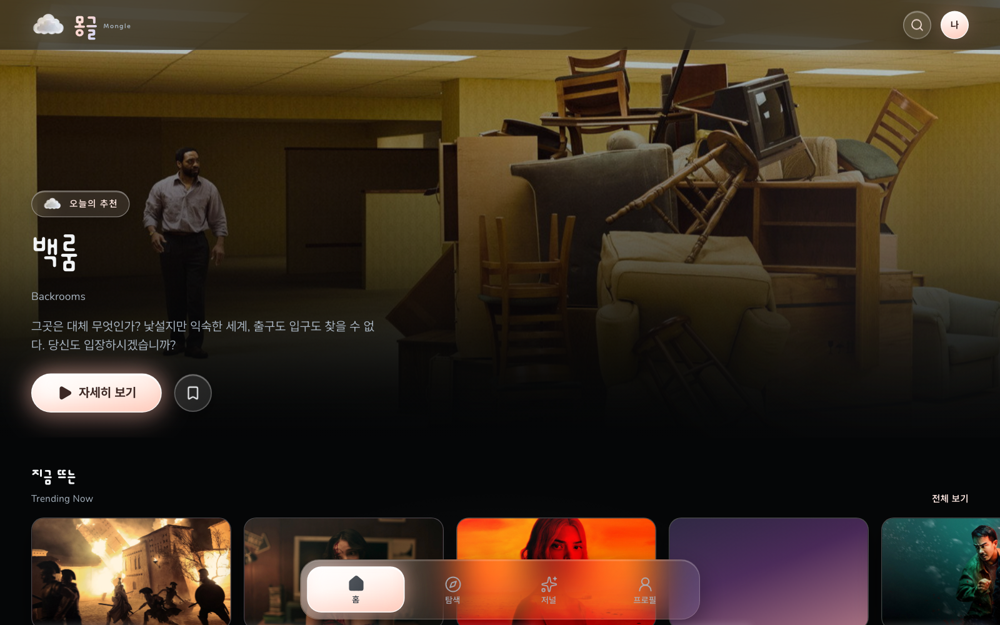
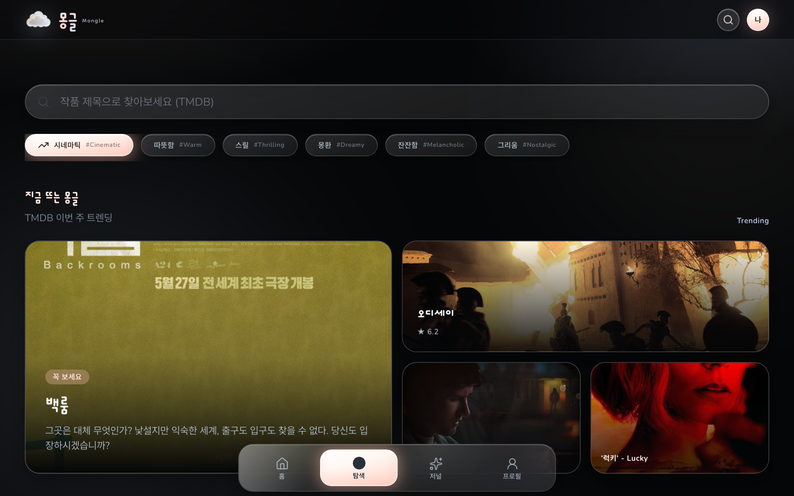
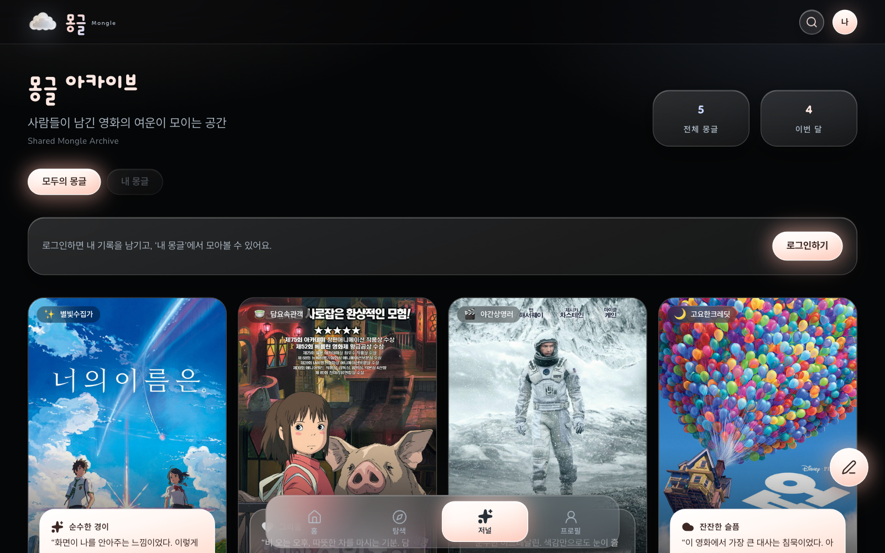
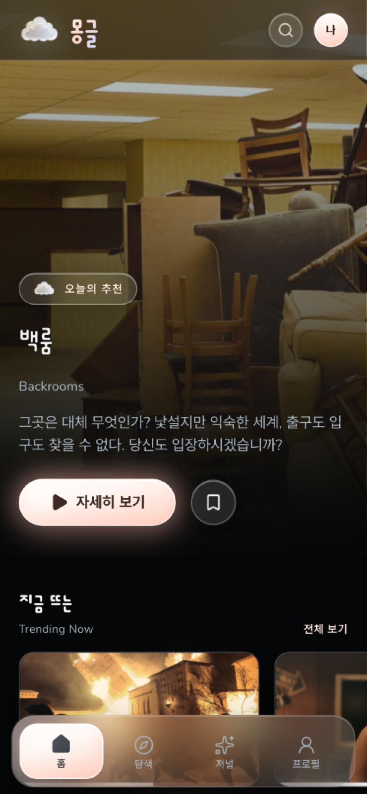

# 몽글 (Mongle)

영화와 감정을 부드럽게 기록하는 시네마틱 웹 앱입니다.  
부드러운 진주(pearl) 글래스 UI 위에, 오늘의 추천 · 감정 탐색 · 저널 아카이브를 담았습니다.

**Live:** [mongle-steel.vercel.app](https://mongle-steel.vercel.app)  
**Repository:** [github.com/august5pm/mongle](https://github.com/august5pm/mongle)

---

## 미리보기

| 홈 | 탐색 |
|:--:|:--:|
|  |  |

| 아카이브 | 모바일 홈 |
|:--:|:--:|
|  |  |

---

## 주요 기능

- **홈** — TMDB 트렌딩·분위기별 디스커버 레일  
- **탐색** — 작품 검색, 감정 칩, 트렌딩 벤토  
- **저널** — Google 로그인 후 감정 한 줄 기록 · 수정·삭제 · 공개 아카이브 · **좋아요**  
- **위시리스트** — 작품 찜 (계정 연동)  
- **프로필** — 닉네임·이모지 아바타

---

## 스택

| 구분 | 선택 |
|------|------|
| Framework | Next.js 14 (App Router) + TypeScript |
| Styling | Tailwind CSS + `globals.css` 유틸 |
| Auth / DB | Supabase (Google OAuth + `journals` / `wishlists` / `journal_likes` + RLS) |
| API | TMDB (검색·트렌딩·상세, 서버 전용 키) |
| Icons | Lucide React |
| Fonts | Dongle(브랜드·제목) · Nunito / Pretendard(본문) |
| Deploy | Vercel |
| Runtime | Node.js 20 (`nvm use 20`) |

---

## 시작하기

```bash
nvm use 20
npm install
cp .env.example .env.local   # 값 채우기
npm run dev
```

브라우저: [http://localhost:3000](http://localhost:3000)

### 환경 변수

| 키 | 설명 |
|----|------|
| `NEXT_PUBLIC_SUPABASE_URL` | Supabase 프로젝트 URL |
| `NEXT_PUBLIC_SUPABASE_ANON_KEY` | anon public key |
| `TMDB_API_KEY` | TMDB API v3 키 (서버 전용) |

구글 로그인·DB 테이블 설정은 [docs/supabase-setup.md](./docs/supabase-setup.md)를 따르세요.

---

## 화면

| 경로 | 설명 |
|------|------|
| `/` | 오늘의 추천, 지금 뜨는(TMDB), 포근한 이야기, 비 오는 날의 영화 |
| `/explore` | 검색, 감정/분위기 칩, 트렌딩 벤토 |
| `/archive` | 모두의 몽글 / 내 몽글, 좋아요, 수정·삭제 |
| `/journal/new` | 작품 선택 → 감정 → 한 줄 메모 (`?edit=` 수정) |
| `/wishlist` | 찜한 작품 목록 (로그인) |
| `/movie/[id]` | 상세, 위시리스트, 기록하기 |
| `/profile` | 닉네임·이모지, 통계 |

---

## 문서

| 문서 | 내용 |
|------|------|
| [docs/README.md](./docs/README.md) | 문서 인덱스 |
| [docs/overview.md](./docs/overview.md) | 제품 개요 · 컨셉 |
| [docs/architecture.md](./docs/architecture.md) | 폴더 구조 · 데이터 |
| [docs/design-system.md](./docs/design-system.md) | 컬러 · 타이포 · 스타일 |
| [docs/screens.md](./docs/screens.md) | 화면별 구성 |
| [docs/roadmap.md](./docs/roadmap.md) | 완료 · 다음 할 일 |
| [docs/supabase-setup.md](./docs/supabase-setup.md) | Auth · 마이그레이션 |

---

## 스크립트

```bash
npm run dev    # 개발 서버
npm run build  # 프로덕션 빌드
npm run start  # 빌드 결과 실행
npm run lint   # ESLint
```

> `next dev` 실행 중 `npm run build`를 돌리면 `.next` 캐시가 깨질 수 있습니다.  
> 이상하면 프로세스를 종료한 뒤 `rm -rf .next && npm run dev`로 재시작하세요.

---

## 라이선스

Private toy project · 개인 학습/포트폴리오용
